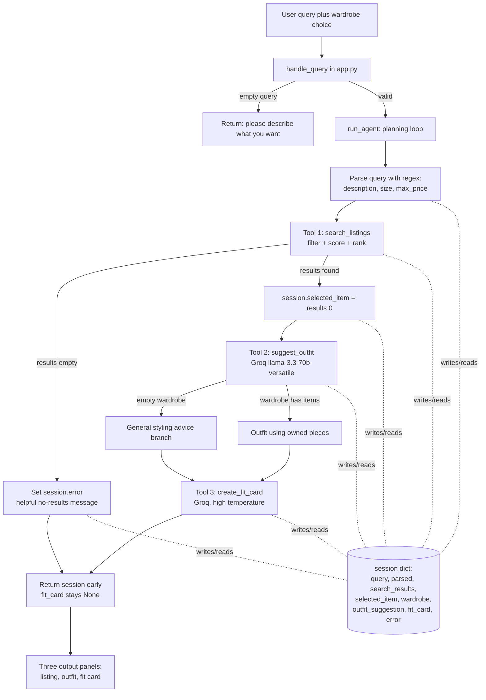

# FitFindr — planning.md

> Complete this document before writing any implementation code.
> Your spec and agent diagram are what you'll use to direct AI tools (Claude, Copilot, etc.) to generate your implementation. The more specific they are, the more useful the generated code will be.
> Your planning.md will be reviewed as part of your submission.
> Update it before starting any stretch features.

---

## Tools

List every tool your agent will use. For each tool, fill in all four fields.
You must have at least 3 tools. The three required tools are listed. Add any additional tools below them.

### Tool 1: search_listings

**What it does:**
Searches the 40-item mock listings dataset for pieces matching a free-text description, scores each candidate by keyword overlap, and returns the matches ranked best first. It is the only non-LLM tool: it is pure Python filtering and ranking over the data loaded by `load_listings()`.

**Input parameters:**
- `description` (str): Free-text keywords describing what the user wants, for example "vintage graphic tee". Tokenized and matched against each listing's text fields.
- `size` (str or None): Size string to filter by, for example "M" or "US 8". Matched case-insensitively as a substring against each listing's `size` field. `None` skips size filtering.
- `max_price` (float or None): Inclusive price ceiling. A listing passes when `price <= max_price`. `None` skips price filtering.

**What it returns:**
A `list[dict]`, sorted by descending relevance score. Each element is a full listing dict from the dataset with these fields: `id` (str), `title` (str), `description` (str), `category` (str), `style_tags` (list[str]), `size` (str), `condition` (str), `price` (float), `colors` (list[str]), `brand` (str or None), `platform` (str). The list contains only listings whose relevance score is greater than zero, after the size and price filters have been applied.

**What happens if it fails or returns nothing:**
Returns an empty list `[]`. It never raises for "no match." An empty list is a valid, expected result and is the signal the planning loop uses to stop early and show a helpful no-results message. The function only raises if the underlying data file is missing or malformed, which is a setup error, not a runtime user error.

---

### Tool 2: suggest_outfit

**What it does:**
Takes one thrifted item and the user's wardrobe and asks Groq `llama-3.3-70b-versatile` to propose one or two complete outfits that combine the new item with named pieces the user already owns. When the wardrobe is empty it instead asks the model for general styling guidance for the item on its own.

**Input parameters:**
- `new_item` (dict): A single listing dict (the selected search result). The tool reads `title`, `category`, `style_tags`, `colors`, and `description` from it to describe the piece to the model.
- `wardrobe` (dict): A wardrobe dict with an `items` key holding a list of wardrobe item dicts (fields: `id`, `name`, `category`, `colors`, `style_tags`, `notes`). May be empty (`items == []`), which must be handled without error.

**What it returns:**
A non-empty `str` containing the model's outfit suggestions in plain prose. For a populated wardrobe the text names specific owned pieces to pair with the new item (for example "wear it with your baggy straight-leg jeans and chunky white sneakers"). For an empty wardrobe the text is general advice (what categories, colors, and silhouettes pair well, what vibe the piece suits) with no references to owned items.

**What happens if it fails or returns nothing:**
- Empty wardrobe is not a failure: the tool branches to the general-advice prompt and still returns useful text.
- If the Groq API call raises (network, auth, rate limit), the tool catches the exception and returns a short, plain-language error string such as "Could not generate an outfit right now. Please check your connection or API key and try again." It does not re-raise, so the agent can still surface something to the user.

---

### Tool 3: create_fit_card

**What it does:**
Turns an outfit suggestion plus the item details into a short, shareable social caption (the kind of thing posted under an OOTD photo). It calls Groq `llama-3.3-70b-versatile` at a high temperature so repeated calls on the same input produce varied captions.

**Input parameters:**
- `outfit` (str): The outfit suggestion text produced by `suggest_outfit()`. This is the primary creative input.
- `new_item` (dict): The listing dict for the thrifted item, used so the caption can mention the item name, price, and platform naturally (once each).

**What it returns:**
A `str` of roughly two to four sentences usable as an Instagram or TikTok caption. It mentions the item title, price, and platform once each, captures the outfit vibe in specific terms, and reads as casual and authentic rather than as a product description. Because temperature is high (around 0.9 to 1.0), two calls with identical inputs return different wording.

**What happens if it fails or returns nothing:**
- If `outfit` is `None`, empty, or whitespace only, the tool returns a descriptive error string such as "No outfit was provided, so a fit card cannot be written. Generate an outfit first." It does not raise.
- If the Groq API call raises, it catches the exception and returns a short error string ("Could not write a fit card right now. Please try again.") rather than propagating the exception.

---

### Additional Tools (if any)

None for the core submission. Stretch ideas (retry-with-fallback for `search_listings`, a price-comparison tool, style-profile memory, trend awareness) will be specced here before any are implemented.

---

## Planning Loop

**How does your agent decide which tool to call next?**

The loop is deterministic and runs the three tools in a fixed pipeline, but it branches on the result of `search_listings`. `run_agent(query, wardrobe)` proceeds as follows:

1. **Initialize:** Build a fresh session with `_new_session(query, wardrobe)`.
2. **Parse the query (no LLM):** Extract `description`, `size`, and `max_price` from the natural-language query using regex, and store them in `session["parsed"]`. The parsing rules are:
   - **max_price:** Search for a price cue with `(?:under|below|less than|<|\$)\s*\$?\s*(\d+(?:\.\d+)?)`. The first capture group becomes `max_price` (float). If no cue is found, `max_price` is `None`.
   - **size:** Search for `\bsize\s+([a-z0-9/.]+)` (case-insensitive). The captured token becomes `size`. Only an explicit "size X" phrase is parsed; a bare letter like "M" elsewhere is ignored to avoid false hits. If absent, `size` is `None`.
   - **description:** Take the original query, remove the matched price and size phrases, and use the remainder as the description keywords. This keeps "vintage graphic tee" while dropping "under $30" and "size M".
   - This rule-based choice is intentional: parsing is cheap, deterministic, and easy to test, and it keeps the only model calls in the two genuinely generative tools.
3. **Branch A, search:** Call `search_listings(description, size, max_price)` and store the result in `session["search_results"]`.
   - **If the list is empty:** set `session["error"]` to a helpful message that names what was searched and suggests a fix (raise the price, drop the size, use broader words), leave `session["selected_item"]`, `session["outfit_suggestion"]`, and `session["fit_card"]` as `None`, and **return immediately**. `suggest_outfit` and `create_fit_card` are never called.
   - **If the list is non-empty:** set `session["selected_item"] = session["search_results"][0]` (top-ranked) and continue.
4. **Branch B, style:** Call `suggest_outfit(session["selected_item"], session["wardrobe"])` and store the result in `session["outfit_suggestion"]`. This runs whether the wardrobe is full or empty; the tool handles the empty case internally.
5. **Branch C, caption:** Call `create_fit_card(session["outfit_suggestion"], session["selected_item"])` and store the result in `session["fit_card"]`.
6. **Done:** Return the session. The loop knows it is finished when either the early no-results return fires (Branch A) or `fit_card` has been populated (after Branch C). There is no multi-turn looping; one query produces one completed session.

The single decision point is the emptiness of `search_results`. Everything downstream depends on having a selected item, so an empty search is the only condition that changes control flow.

---

## State Management

**How does information from one tool get passed to the next?**

All state for one interaction lives in a single `session` dict created by `_new_session()`. Tools do not call each other and do not share globals; the loop reads from and writes to the session between calls, so each tool's output becomes the next tool's input through named keys.

Tracked fields and when they are written:

| Key | Written by | Read by | Meaning |
|-----|-----------|---------|---------|
| `query` | `_new_session` | parsing step | Original user text |
| `parsed` | parsing step | `search_listings` call | `{description, size, max_price}` |
| `search_results` | after `search_listings` | branch check | Ranked list of listing dicts |
| `selected_item` | after non-empty search | `suggest_outfit`, `create_fit_card` | Top-ranked listing dict |
| `wardrobe` | `_new_session` | `suggest_outfit` | User's wardrobe dict |
| `outfit_suggestion` | after `suggest_outfit` | `create_fit_card` | Outfit prose string |
| `fit_card` | after `create_fit_card` | caller / UI | Shareable caption string |
| `error` | on early exit | caller / UI | Non-null only when the run stopped early |

The hand-offs are explicit object passes: the exact dict stored in `session["selected_item"]` is the same object handed to both `suggest_outfit` and `create_fit_card`, and the exact string in `session["outfit_suggestion"]` is the same string handed to `create_fit_card`. No re-entry of the query and no re-running of search is needed. The caller (CLI or `handle_query` in `app.py`) inspects `session["error"]` first; if it is `None`, it reads `selected_item`, `outfit_suggestion`, and `fit_card` for display.

---

## Error Handling

For each tool, describe the specific failure mode you're handling and what the agent does in response.

| Tool | Failure mode | Agent response |
|------|-------------|----------------|
| search_listings | No results match the query | Returns `[]`. The loop sets `session["error"]` to a specific message, for example: "No matches for 'designer ballgown' under $5 in size XXS. Try raising your price, removing the size filter, or using broader terms like 'dress'." The agent stops early, shows this in the listing panel, and leaves the outfit and fit-card panels empty. It does not call the other two tools. |
| suggest_outfit | Wardrobe is empty | Not treated as an error. The tool detects `wardrobe["items"] == []` and switches to a general-advice prompt, returning styling guidance for the item on its own (suitable categories, colors, silhouettes, and vibe) so the user still gets value. |
| suggest_outfit | Groq API call fails | Catches the exception and returns "Could not generate an outfit right now. Please check your connection or API key and try again." The loop still proceeds to `create_fit_card`, which will produce its own guarded output. |
| create_fit_card | Outfit input is missing or incomplete | Guards `outfit` for `None`/empty/whitespace and returns "No outfit was provided, so a fit card cannot be written. Generate an outfit first." rather than raising, so a blank panel never shows a stack trace. |
| create_fit_card | Groq API call fails | Catches the exception and returns "Could not write a fit card right now. Please try again." The other panels (listing, outfit) still display normally. |
| run_agent / app | Empty user query submitted | `handle_query` guards an empty or whitespace query before calling `run_agent`, returning "Please describe what you're looking for." in the listing panel and empty strings for the other two. |

---

## Architecture



Plain-text version of the same flow, including the early error branch:

```
            +---------------------------+
 user --->  |   handle_query (app.py)   |
            +-------------+-------------+
                          | valid query
                          v
            +---------------------------+        +-------------------------+
            |   run_agent (loop)        | <----> |   session dict (state)  |
            |  1. parse query (regex)   |        |  query, parsed,         |
            |  2. search_listings  -----|----+   |  search_results,        |
            +---------------------------+    |   |  selected_item,         |
                          |                  |   |  wardrobe,              |
              results found|                 |   |  outfit_suggestion,     |
                          v                  |   |  fit_card, error        |
            +---------------------------+    |   +-------------------------+
            |  selected_item = results[0]|   |
            |  3. suggest_outfit (LLM)  |    | results EMPTY
            |  4. create_fit_card (LLM) |    v
            +-------------+-------------+   set session.error
                          |                 return early (fit_card = None)
                          v                          |
            +---------------------------+            |
            |  three output panels      | <----------+
            |  listing / outfit / card  |
            +---------------------------+
```

---

## AI Tool Plan

I will use **Claude (Claude Code)** as the implementation assistant. For each step I give it the specific planning.md sections below as the spec, then verify against concrete checks before moving on.

**Milestone 3, individual tool implementations:**

1. **search_listings:** Feed Claude the Tool 1 spec (inputs, return shape, failure behavior), the Planning Loop parsing rules, and the `load_listings()` field list. Ask it to implement filtering (price, size), keyword scoring, drop-zero, and descending sort. **Verify** by: (a) `search_listings("vintage graphic tee", None, 30)` returns non-empty with every `price <= 30`; (b) `search_listings("designer ballgown", "XXS", 5)` returns `[]` with no exception; (c) lowering `max_price` strictly shrinks or keeps the result set. These become the pytest cases.
2. **suggest_outfit:** Feed Claude the Tool 2 spec plus the wardrobe item field list. Ask for the empty-vs-populated branch and the Groq call on `llama-3.3-70b-versatile`. **Verify** by: running it with `get_example_wardrobe()` (output should name owned pieces) and with `get_empty_wardrobe()` (output should be general advice, no crash, non-empty).
3. **create_fit_card:** Feed Claude the Tool 3 spec including the high-temperature and empty-guard requirements. **Verify** by: calling it three times on the same outfit and confirming the captions differ; calling it with `outfit=""` and confirming a descriptive error string (not an exception).
4. **Tests:** Ask Claude to write `tests/test_tools.py` covering the search happy path, the empty-result path, and the price-filter path (the three deterministic checks above; LLM tools are smoke-tested, not asserted on exact text). **Verify** with `pytest tests/`.

**Milestone 4, planning loop and state management:**

Feed Claude the Planning Loop and State Management sections and the existing `_new_session`/`run_agent` stubs. Ask it to implement the regex parsing, the search branch (early return on empty), and the two downstream calls, writing every intermediate to the session. Then feed it the `handle_query` TODO and the session-key table to map results to the three panels. **Verify** by: running `python agent.py` (happy path prints a found title, outfit, and fit card; no-results path prints an error) and by temporarily printing `session["selected_item"]` and `session["outfit_suggestion"]` mid-run to confirm the same objects flow forward.

---

## A Complete Interaction (Step by Step)

Write out what a full user interaction looks like from start to finish, tool call by tool call. Use a specific example query.

**What FitFindr does:** FitFindr is a multi-tool AI agent that helps a shopper find secondhand clothing and figure out how to wear it. A natural language query with an optional size and price ceiling triggers `search_listings`, which filters and ranks the mock listings, and the top match then triggers `suggest_outfit`, which reads the user's wardrobe to propose concrete outfits before that outfit text triggers `create_fit_card` to write a short shareable caption. On failure the agent degrades gracefully: if `search_listings` finds nothing it stops early and tells the user what failed and what to try, if the wardrobe is empty `suggest_outfit` returns general styling advice instead of crashing, and if the outfit text is missing `create_fit_card` returns a descriptive error string rather than raising.

**Example user query:** "I'm looking for a vintage graphic tee under $30. I mostly wear baggy jeans and chunky sneakers. What's out there and how would I style it?"

**Step 1, parse (no tool, inside run_agent):**
The loop parses the query with regex. The price cue "under $30" yields `max_price = 30.0`. There is no "size X" phrase, so `size = None`. The remaining keywords give `description = "looking for a vintage graphic tee i mostly wear baggy jeans and chunky sneakers ..."`. Stored as `session["parsed"] = {"description": ..., "size": None, "max_price": 30.0}`.

**Step 2, search_listings("...vintage graphic tee...", None, 30.0):**
The tool drops listings priced above 30, then scores the rest by keyword overlap on `title`, `style_tags`, `description`, `category`, and `colors`. "Graphic Tee — 2003 Tour Bootleg Style" (`lst_006`, $24, style_tags include "graphic tee", "vintage") scores highest, ahead of other tees like the Y2K baby tee (`lst_002`, $18) and the vintage band tee (`lst_033`, $19). Returns a non-empty ranked list. `session["search_results"]` holds it, and because it is non-empty, `session["selected_item"] = lst_006`.

**Step 3, suggest_outfit(lst_006, example_wardrobe):**
The selected tee plus the 10-item example wardrobe go to Groq. The model returns prose pairing the tee with owned pieces, for example tucking it into the baggy straight-leg jeans (`w_001`), layering the vintage black denim jacket (`w_006`), and finishing with the chunky white sneakers (`w_007`). Stored as `session["outfit_suggestion"]`.

**Step 4, create_fit_card(outfit_suggestion, lst_006):**
The outfit text and item go to Groq at high temperature. The model returns a casual two-to-four-sentence caption that names the tee, its $24 price, and its Depop platform once each and captures the thrifted-streetwear vibe. Stored as `session["fit_card"]`. `session["error"]` stays `None`.

**Final output to user:**
The three panels populate: the **listing** panel shows the formatted top result (`lst_006`: title, price, size, condition, platform, description), the **outfit** panel shows the styling suggestion from Step 3, and the **fit card** panel shows the shareable caption from Step 4. The user sees a found item, how to wear it with clothes they already own, and a ready-to-post caption.
